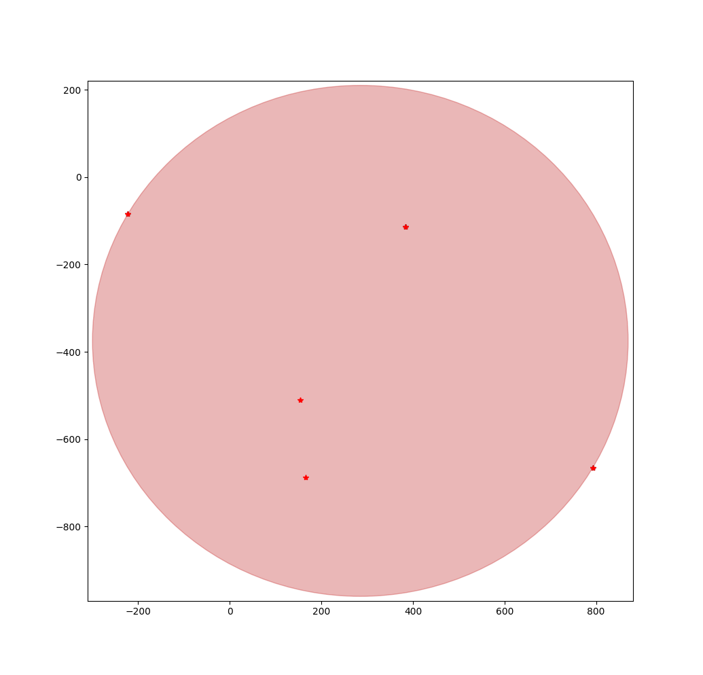
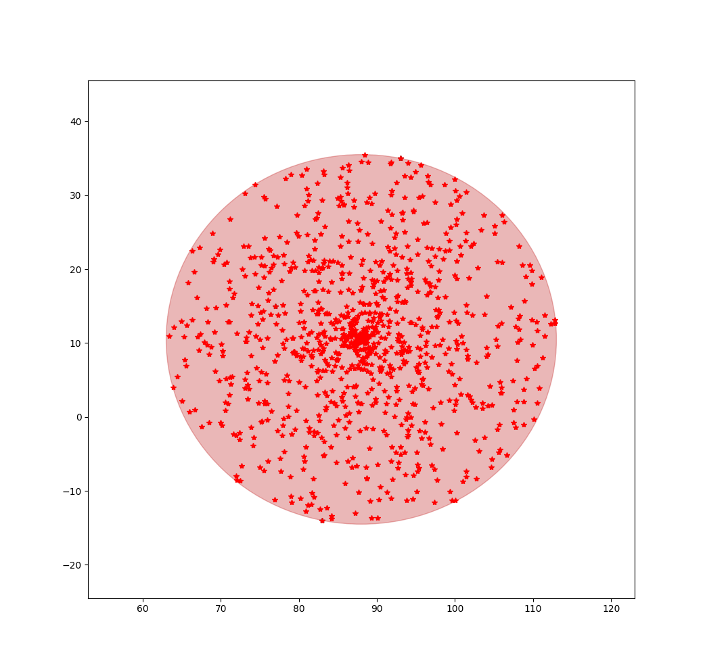
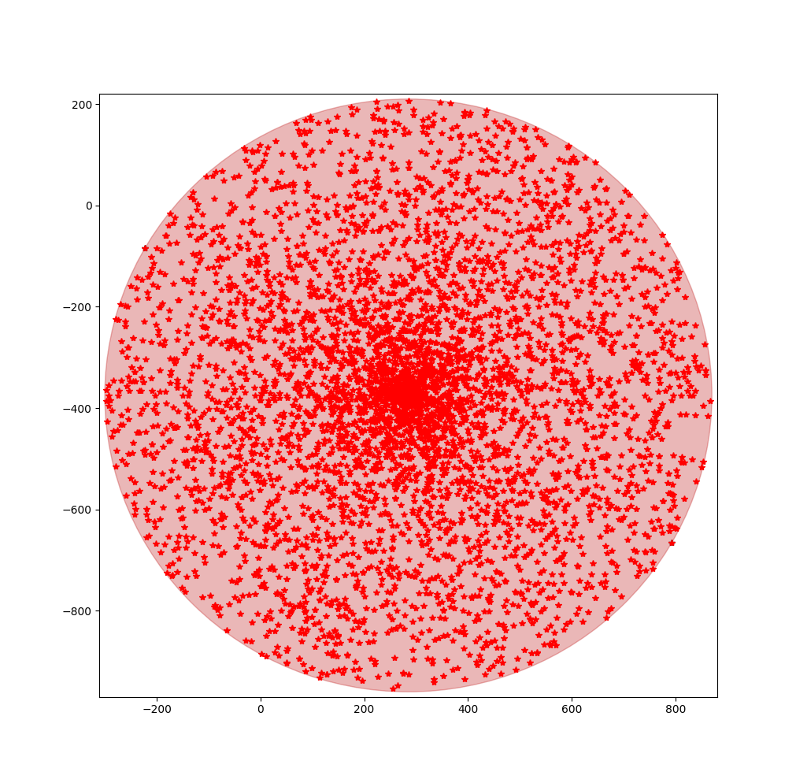

## Overview
This project is an implementation of Smallest Enclosing Disc algorithm described in the book Computational Geometry (section 4.7). The following pictures show some test cases for 5 points, 500 points, and 5000 points.

    

## Build
Cmake version 2.8.3.
```
mkdir build
cd build
cmake ..
make
```
## Run
```
cd build
./SmallestCircle
```
You could also play with the range and number of test points. The following command tests 10,000 points within 100:
```
./SmallestCircle 100 10000
```
To visualize the test data,
```
cd src
python smallest_circle_visualization.py
```

## Implementation
The algorithm takes a vector of points as input and return a circle. The point and circle class are defined as follows. All the member functions are ignored for illustration purpose.

```cpp
struct Point {
  double x, y;
};

struct Circle {
  Point center;
  double radius = 0;
};
```

This structure is chosen so that the algorithm could do an efficient point-circle enclosure checking, i.e.:
```cpp
struct Point {
  // Return the squared length of the vector
  const double LengthSquare() const { return Dot(*this); }
};

struct Circle {
 // Check if the circle encloses a point
  bool Encloses(const Point& p){
    return radius > 0 && center.DistanceSquare(p) <= radius * radius + Epsilon;
}
};
```

In the algorithm, we need to calculate a circle from two given points or three given points, which are handled differently. It's very clear that a minimal circle that encloses two points must have these two points on its diameter line. To calculate the minial circle from three points, the algorithm from [Circumscribed circle](https://en.wikipedia.org/wiki/Circumscribed_circle) is used. It's worth mention that these three points must not be colinear. In the algorithm, three colinear points will be first solved by constructing a circle from two points so this won't be a problem.

## Testing
The code was tested against the following test cases:
1. One point input, it returns a circle with the point as center and zero radius.
1. Two points input, it returns the middle of 2 points as center and half of the length as radius
1. Three colinear points, return a circle similar to two-points case that enclosed the third point
1. More than three points. This test is done in the following way.

    1. Randomly generate three points and a minimal circle using brute force, this serves as ground truth
    1. Randomly generate points that are inside of the ground truth circle
    1. Compute the smallest circle using the alorithm and compare with the ground truth
    
